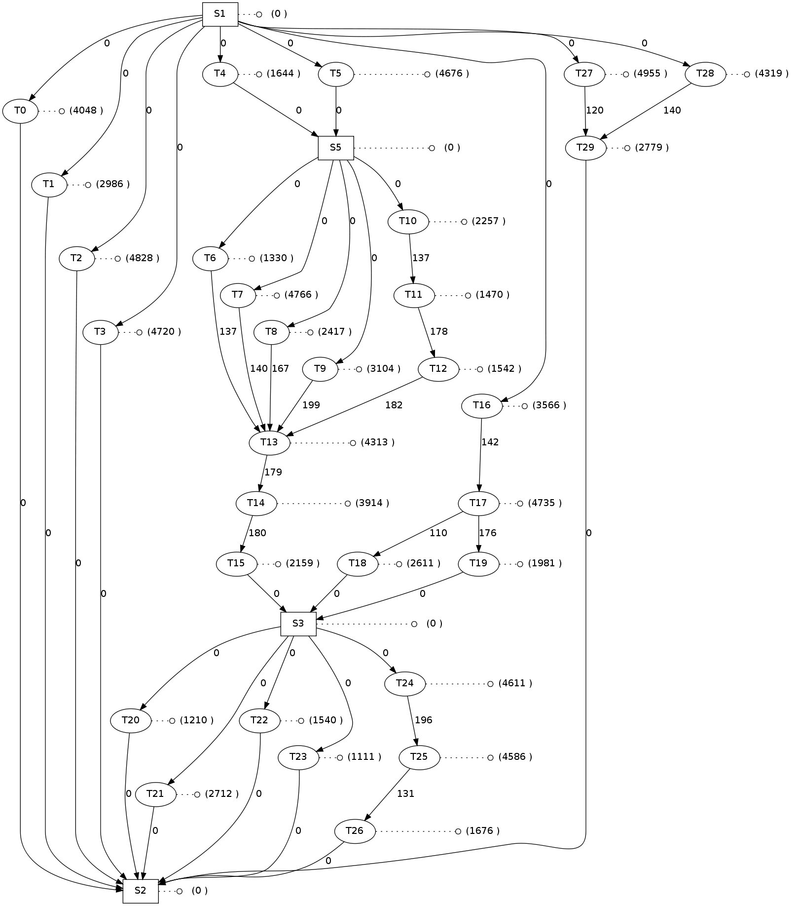
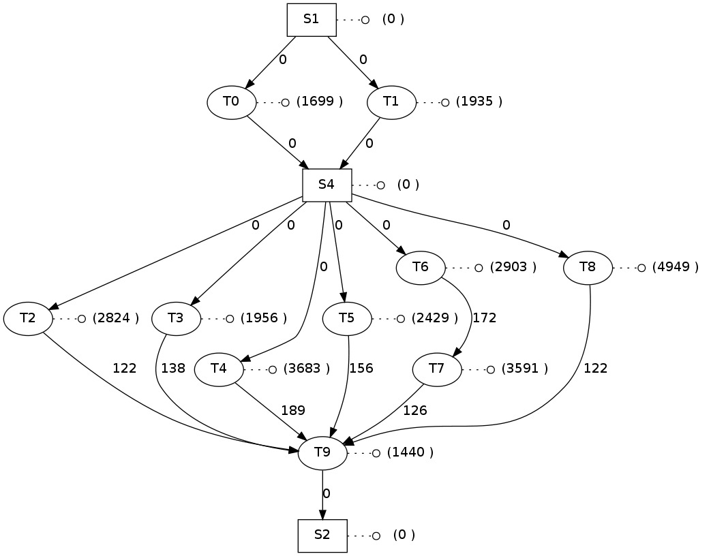

Introduction
============

This tool generates task graph, modeling precedence constraints among tasks
and communication requirements.

A task is formally defined by:
- edges, representing tasks. A specific worst-case computational time
  features each task
- vertices, representing precedence constraints among tasks. Each of them is
  characterized by the amount of exchanged data.
  Such dependencies are represented as: a -> b. Meaning that the task b must
  start not earlier than the end of task a.

The software implements two different generators.
The first algorithm is called CODESTYLE generator and basically does:
1.divide the actual task set into two groups
2.decide randomly how to execute the two group: in parallel or sequentially
3.repeat recursevely step 1 for the two groups
The execution flow of the second algorithm is the following:
1. generate the task set
2. pick a task from the task set
3. pick a second task from the neighborhood of the first task
4. create a dependency between them
5. repeat step 2 until the number of desired dependencies is reached

Example
=======

Let us consider two examples, obtained by using the CODE-STYLE algorithm.

The first one () contains 30 real tasks (without considering
synchronization points) with a probability 0.5 (within [0.0, 1.0]) of
having either a parallel or sequential execution.

The second example () contains 10 real task and probability 0.7
(parallel executions are more probable than sequential ones).


Required packages
=================

Required libraries:
- GFlags Library: http://code.google.com/p/gflags/
- Protobuf Library: http://code.google.com/p/protobuf/

Suggested software:
- Graphviz: http://www.graphviz.org/


How to
======

Compile:
```
make
```

Once the software has been compiled, execute:
```
./software --binaryFile BINARY_OUTPUT_FILE [OPTIONS]
```
where:
- binaryFile: Binary file with the generated task graph (string)
- plainTextFile: Plain text with the generated task graph (string)
- graphvizFile: DOT file with the generated task graph (string)
- maxWcet: Maximum Worst-Case Execution Time (int32)
- minWcet: Minimum Worst-Case Execution Time (int32)
- maxExchangedData: Maximum amount of exchanged data (int32)
- minExchangedData: Minimum amount of exchanged data (int32)
- dependencyDistance: Maximum dependency distance (int32)
- nOfDependencies: Number of Dependencies (int32)
- nOfTasks (Number of tasks) type: int32 default: 15
- probSeqPar (Ser/Par probability [0, 1]) type: double default: 0.5
- taskGenerator: Task generator to use:
-- 0: code-style generator (SUGGESTED ALGORITHM)
-- 1: data-flow generator												1

A script has been provided to make the use easier.
It automatically generate the binary file and the png image.
```
./script.sh [GENERATIONNAME]
```
Suppose you type:
___
./script example
___
The following files are generated
- example.bin: serialized tash graph (using the Protobuf library)
- example.txt: plain text task graph description
- example.dot: task graph representation using DOT language
- example.png: graphical representation of the task graph (using dot command)

In case you want to regenerate source files for the serialization:
```
make gen
```


Other software
=============

Alternative software that you would like to test:
- TGFF: http://ziyang.eecs.umich.edu/~dickrp/tgff/
- STG: http://www.kasahara.elec.waseda.ac.jp/schedule/
- TaskGraphGenerator: http://sourceforge.net/projects/taskgraphgen/
- http://ai.unibo.it/node/410
